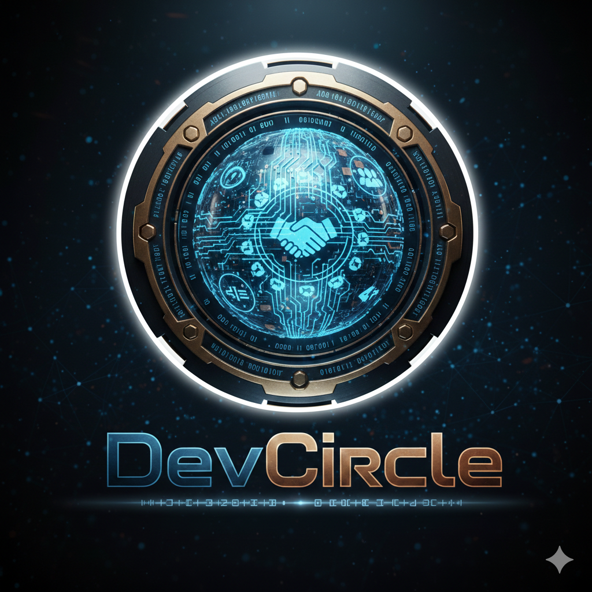
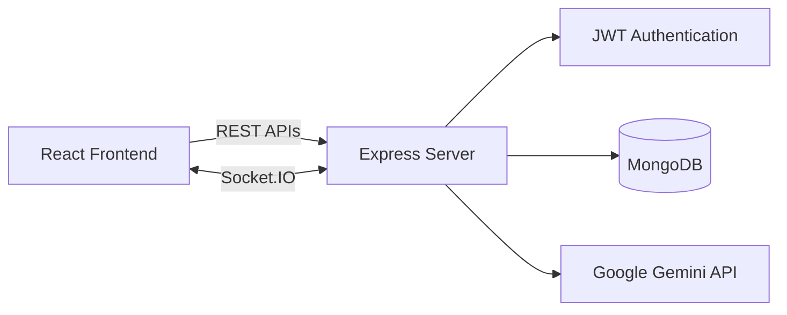

# <p align="center"></p>

<h1 align="center">DevCircle Backend</h1>

<p align="center">
<strong>Node.js Backend powering Developer Networking, Real-Time Communication, Collaborative AI Workspaces and AI Assessments</strong>
</p>

<p align="center">
Built with Express.js • MongoDB • Socket.IO • Google Gemini
</p>

<p align="center">
<a href="https://www.devcircle.co.in">
  
</a>
</p>

<p align="center">


<br>


</p>

---

# 🚀 Overview

This repository contains the backend powering **DevCircle**, an AI-powered developer collaboration platform.

The backend exposes REST APIs, manages JWT authentication, handles Socket.IO communication, integrates with Google Gemini, persists application data in MongoDB, and coordinates collaborative AI workspaces and AI-powered technical assessments.

---

# ✨ Core Responsibilities

- JWT Authentication & Authorization
- REST API Development
- Developer Networking
- Connection Management
- Real-Time Chat
- Socket.IO Event Management
- Collaborative AI Workspace
- AI Assessment Generation
- AI Answer Evaluation
- Dashboard Data Aggregation
- MongoDB Persistence
- Google Gemini Integration

---

# 🏗 Backend Architecture



---

# 🔐 Authentication Flow

```text
User Login
    ↓
Verify Credentials
    ↓
Generate JWT
    ↓
HTTP Only Cookie
    ↓
Protected APIs & Socket Authentication
```

---

# 💬 Real-Time Communication

- One-to-one messaging
- Online/offline presence
- Room-based messaging
- Multi-device support
- Collaborative workspace synchronization

---

# 🤝 Collaborative AI Workspace

## Features

- Workspace authorization
- Controlled edit ownership
- Request/Approval workflow
- Shared drafts
- Prompt synchronization
- Generation locking
- Conversation persistence
- Context-aware Gemini conversations

## Workflow

```text
Join Workspace
      ↓
Authorize User
      ↓
Sync Workspace State
      ↓
Request Edit Access
      ↓
Grant Ownership
      ↓
Live Prompt Sync
      ↓
Submit Prompt
      ↓
Retrieve Conversation History
      ↓
Generate Gemini Response
      ↓
Persist & Broadcast
```

---

# 🧠 AI Assessment Engine

```text
Prompt
  ↓
Generate Assessment
  ↓
Submit Answers
  ↓
AI Evaluation
  ↓
Per-question Scores
  ↓
Overall Feedback
  ↓
Dashboard Analytics
```

---

# 🗄 Database Collections

- Users
- Connection Requests
- Conversations
- Messages
- AI Workspaces
- AI Messages
- Assessments
- Assessment Responses

---

# ⚙️ Environment Variables

```env
PORT=
MONGODB_URI=
JWT_SECRET=
GEMINI_API_KEY=
FRONTEND_URL=
CLOUDINARY_CLOUD_NAME=
CLOUDINARY_API_KEY=
CLOUDINARY_API_SECRET=
```

---

# 🚀 Local Setup

```bash
git clone https://github.com/kapil2570/DevCircle-Backend.git
cd DevCircle-Backend
npm install
npm start
```

---

# 🔗 Related Repositories

Frontend: https://github.com/kapil2570/DevCircle-Frontend

Backend: https://github.com/kapil2570/DevCircle-Backend

Live: https://www.devcircle.co.in

---

# 👨‍💻 Author

**Kapil Sahu**

- LinkedIn: https://www.linkedin.com/in/kapil-sahu1911/
- GitHub: https://github.com/kapil2570

---

⭐ If you found this project interesting, consider giving the repository a star.
