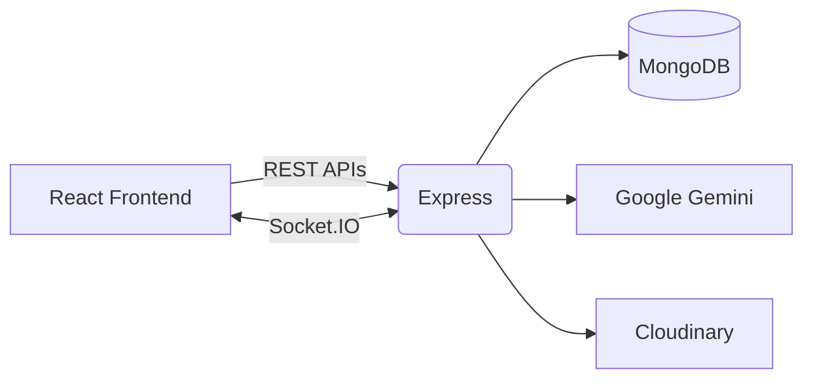

# <p align="center"></p>

<h1 align="center">DevCircle Backend</h1>

<p align="center"><strong>Backend for the AI‑Powered Developer Collaboration Platform</strong></p>

<p align="center">
Node.js • Express.js • MongoDB • Socket.IO • Google Gemini
</p>

<p align="center">
<a href="https://www.devcircle.co.in">

</a>
</p>

<p align="center">


<br>


</p>

---

# 🚀 Overview

This repository contains the backend powering **DevCircle**, an AI-powered developer collaboration platform that combines developer networking, real-time communication, collaborative AI workspaces, and AI-powered technical assessments.

The backend is responsible for:

- JWT & Cookie based authentication
- REST API layer
- Real-time communication using Socket.IO
- Google Gemini integration
- MongoDB persistence
- Collaborative AI workspace coordination
- AI assessment generation & evaluation
- Dashboard analytics

---

# ✨ Core Features

## 🔐 Authentication

- JWT authentication
- HTTP-only cookies
- Protected REST APIs
- Socket authentication middleware

## 👥 Developer Networking

- User discovery
- Profile management
- Connection request lifecycle

## 💬 Real-Time Messaging

- One-to-one messaging
- Room-based Socket.IO architecture
- Online/offline tracking
- Persistent chat history

## 🤝 Collaborative AI Workspace

The backend coordinates a synchronized AI workspace for two connected developers.

### Features

- Workspace authorization
- Shared draft persistence
- Controlled edit ownership
- Edit request / approval workflow
- Live prompt synchronization
- AI generation locking
- Conversation history restoration
- Context-aware Gemini conversations

### Request Flow

```text
Join Workspace
      ↓
Authorize User
      ↓
Join Socket Room
      ↓
Edit Ownership
      ↓
Live Prompt Sync
      ↓
Prompt Submission
      ↓
Retrieve AI History
      ↓
Gemini Response
      ↓
Persist Response
      ↓
Broadcast To Participants
```

## 🧠 AI Assessment Engine

Generate customized assessments from natural-language prompts.

Example:

> Practice advanced React interview questions.

Pipeline:

```text
Prompt
 ↓
Assessment Generation
 ↓
Assessment Stored
 ↓
Answer Submission
 ↓
AI Evaluation
 ↓
Per Question Score
 ↓
Overall Feedback
 ↓
Dashboard Analytics
```

Every response receives:

- Question score (0–10)
- Detailed feedback
- Overall score
- Improvement recommendations

---

# 🏗 Architecture



---

# 📂 Project Structure

```text
src
├── app.js
├── routes
│   ├── auth.js
│   ├── user.js
│   ├── profile.js
│   ├── request.js
│   ├── chat.js
│   ├── assessment.js
│   └── dashboard.js
├── sockets
│   ├── index.js
│   ├── chat.socket.js
│   ├── aiWorkspace.socket.js
│   └── onlineUsers.js
├── models
│   ├── user.js
│   ├── chat.js
│   ├── connectionRequest.js
│   ├── assessment.js
│   ├── aiWorkspace.js
│   └── aiUsage.js
├── middlewares
├── config
└── utils
```

---

# 🗄 Database Models

| Model | Responsibility |
|-------|----------------|
| User | Authentication, developer profile and metadata |
| ConnectionRequest | Tracks connection lifecycle |
| Chat | Conversations and messages |
| AIWorkspace | Shared workspace state and generation lock |
| AIUsage | AI usage tracking |
| Assessment | Generated assessments, responses and evaluation |

---

# ⚙️ Environment Variables

```env
PORT=
MONGODB_URI=
CLOUDINARY_CLOUD_NAME=
CLOUDINARY_API_KEY=
CLOUDINARY_API_SECRET=
JWT_SECRET=
CLIENT_URL=
NODE_ENV=
GEMINI_API_KEY=
```

---

# 🚀 Running Locally

```bash
git clone https://github.com/kapil2570/DevCircle-Backend.git

cd DevCircle-Backend

npm install

npm run dev
```

---

# 📦 Available Scripts

```bash
npm run dev     # Start with nodemon
npm start       # Production
```

---

# 🔗 Related Repositories

**Frontend**

https://github.com/kapil2570/DevCircle-Frontend

**Backend**

https://github.com/kapil2570/DevCircle-Backend

**Live Platform**

https://www.devcircle.co.in

---

# 👨‍💻 Author

**Kapil Sahu**

- GitHub: https://github.com/kapil2570
- LinkedIn: https://www.linkedin.com/in/kapil-sahu1911/

---

If you found this project interesting, consider giving it a ⭐.
